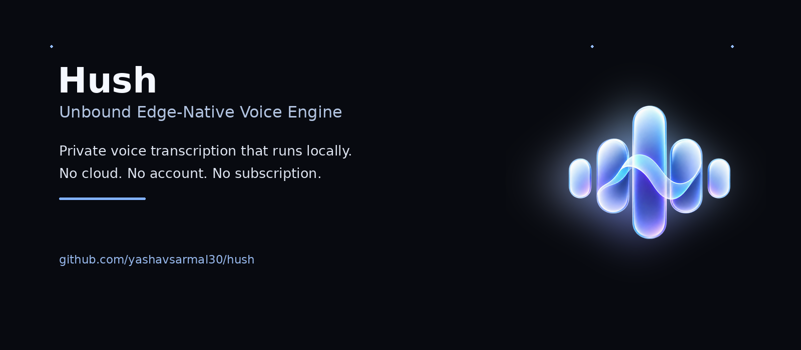
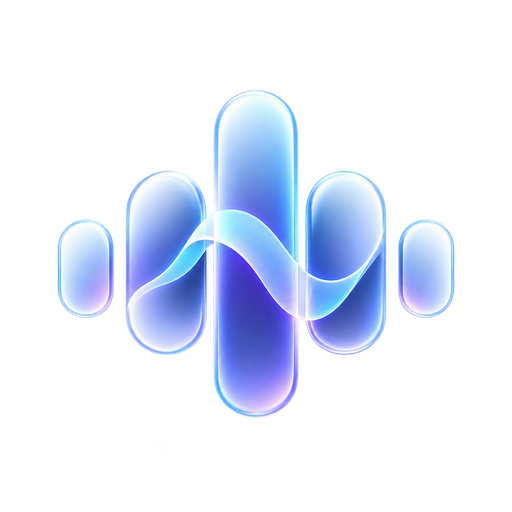
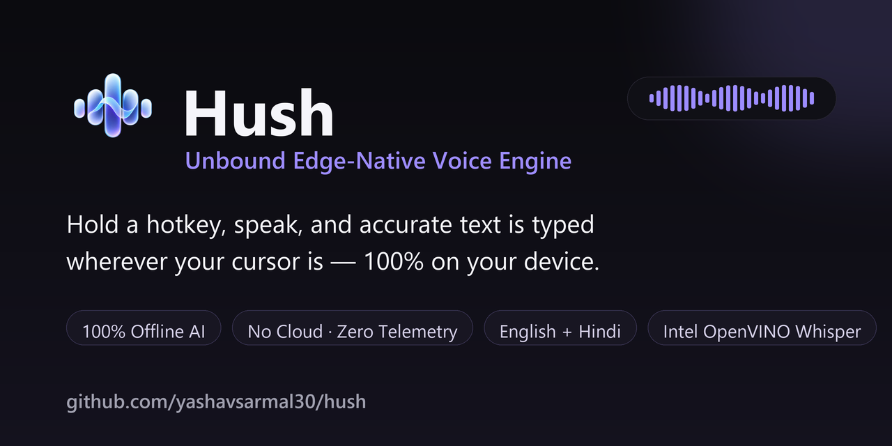

<div align="center">



<br>



# Hush

### Unbound Edge-Native Voice Engine

A fast, private, 100% offline alternative to cloud dictation tools like Wispr Flow and Dragon.  
**No cloud. No account. No subscription. No telemetry.** Your voice never leaves your device.

[](https://github.com/yashavsarmal30/hush/releases/latest)
&nbsp;
[](LICENSE)
[](#windows-installation)
&nbsp;
[](#linux-arch)

 &nbsp;
 &nbsp;


<br>



<br><br>

<em>Live dictation in English and Hindi — text streams right at your active cursor.</em>

</div>

---

## Highlights

Paid dictation applications are fast and accurate, but they stream your microphone audio to remote servers, charge costly recurring subscriptions, and fail without an internet connection. **Hush** delivers the same fluid **press-to-talk, type-anywhere** workflow while executing **100% locally on your own machine** — free and open source forever.

- 🎙️ **Types Anywhere Without Stealing Focus** — Terminals, Word, Excel, Slack, VS Code, Google Docs, browsers, and even elevated administrative windows. Keystrokes are injected directly at your cursor via native Windows `SendInput` with a clipboard fallback.
- ✨ **Wispr Flow Aesthetic UI** — Built with **Electron**, **React 18**, **Tailwind CSS**, and **shadcn/ui**. Features a floating transparent capsule overlay with a fluid 18-bar reactive audio waveform.
- 🎛️ **Dual Dictation Modes**:
  - **Regular Mode**: Hold-to-talk (`Ctrl+Win`). A clean, distraction-free waveform capsule with no extra buttons. Automatically stops and transcribes the second you release the hotkey.
  - **Hands-Free Mode**: Toggle continuous dictation (`Ctrl+Alt+D`). Displays interactive Stop (⏹) and Cancel (✕) controls on the capsule for extended talking sessions.
- 🌍 **English + Hindi + Hinglish** — Seamless auto-detection per phrase. Hindi mistaken by Whisper for Urdu is automatically normalized back to proper left-to-right Devanagari. Switch languages in one click from the tray.
- 🧠 **Noise-Robust Voice Activity Detection** — Energy and VAD gates filter out background static and silence so the engine never produces phantom transcriptions.
- 🔒 **100% Private Edge AI** — OpenAI Whisper running locally via **Intel OpenVINO** (int8 quantized on CPU). No GPU required. The only network request is an optional one-time model download triggered by you.
- 🪟 **System Tray & Background Operation** — Closes to the system tray so Hush stays hotkey-ready in the background without cluttering your taskbar.

---

## Architecture Overview

Hush is structured as a modular, decoupled desktop architecture:

```
┌────────────────────────────────────────────────────────────────────────┐
│                        ELECTRON DESKTOP APPLICATION                    │
│                                                                        │
│   ┌───────────────────────────┐      ┌─────────────────────────────┐   │
│   │   Floating Overlay Pill   │      │      Main Settings Hub      │   │
│   │ (Transparent, No-Focus)   │      │   (Tabs, Dictation Pad,     │   │
│   │  • 18-bar reactive audio  │      │    Dictionary, History)     │   │
│   │  • Regular & Hands-Free   │      │                             │   │
│   └─────────────┬─────────────┘      └──────────────┬──────────────┘   │
│                 │                                   │                  │
│                 └─────────────────┬─────────────────┘                  │
│                                   │                                    │
│                 ┌─────────────────▼─────────────────┐                  │
│                 │       React 18 + shadcn/ui        │                  │
│                 │      Zustand / useHush Hook       │                  │
│                 └─────────────────┬─────────────────┘                  │
│                                   │ WebSocket (ws://127.0.0.1:4874)    │
└───────────────────────────────────┼────────────────────────────────────┘
                                    │
┌───────────────────────────────────▼────────────────────────────────────┐
│                    HEADLESS PYTHON ENGINE (SIDECAR)                    │
│                                                                        │
│   ┌───────────────────────────┐      ┌─────────────────────────────┐   │
│   │    OpenVINO Whisper int8  │      │   sounddevice Audio Stream  │   │
│   │  • 100% offline CPU model │      │  • 16kHz mono capture       │   │
│   │  • VAD & energy gating    │      │  • Real-time waveform RMS   │   │
│   └─────────────┬─────────────┘      └──────────────┬──────────────┘   │
│                 │                                   │                  │
│   ┌─────────────▼─────────────┐      ┌──────────────▼──────────────┐   │
│   │  Low-Level Keyboard Hook  │      │    Direct Keystroke Inject  │   │
│   │  • Global hotkeys (Win32) │      │  • Win32 SendInput API      │   │
│   │  • Hold chord & Toggle    │      │  • Elevated console support │   │
│   └───────────────────────────┘      └─────────────────────────────┘   │
└────────────────────────────────────────────────────────────────────────┘
```

---

## Installation

### Windows Installation

#### Option A: Pre-built Release Installer (Recommended)
1. Download `Hush Setup 1.4.0.exe` or `Hush-windows-x64.zip` from [Latest Releases](https://github.com/yashavsarmal30/hush/releases/latest).
2. Run the installer. If Windows SmartScreen displays an "Unknown Publisher" prompt (common for open-source unsigned code), click **More info → Run anyway**.
3. On first launch, download the recommended model (~300 MB) from **Settings → Models**.
4. Hold **`Ctrl + Win`**, speak your thoughts, and release. Accurate text is typed wherever your cursor is!

#### Option B: Automated PowerShell Install
If you have cloned the repository or extracted the release files:

```powershell
# Installs Hush into %LOCALAPPDATA%\Programs\Hush and configures Start Menu shortcuts
powershell -ExecutionPolicy Bypass -File packaging\windows\install.ps1
```

> **Elevated Windows Support**: The installer automatically generates an **`Hush (administrator)`** shortcut in your Start Menu. Launching via this shortcut permits Hush to inject simulated keystrokes into elevated PowerShell consoles, Windows Terminal (Admin), and Registry Editor without UIPI restriction errors.

---

### Linux (Arch)

Hush runs on Linux under both **X11** and **Wayland**:

```bash
git clone https://github.com/yashavsarmal30/hush.git
cd hush/packaging/arch
makepkg -si                       # Or install from AUR: yay -S hush
sudo usermod -aG input "$USER"    # One-time: allows reading hotkeys via evdev
```

Log out and back in, then launch **Hush** from your application launcher. Typing is powered by `xdotool` (X11) or `wtype` (Wayland) to ensure complete Unicode and Devanagari fidelity. See [`packaging/arch/`](packaging/arch/) for packaging internals.

---

## Build from Source

### Prerequisites
- **Node.js**: v18+ (Node 20+ recommended)
- **Python**: 3.10+ (64-bit)
- **Git**

### 1. Clone & Set Up Python Engine
```powershell
git clone https://github.com/yashavsarmal30/hush.git
cd hush

# Create and activate virtual environment
python -m venv .venv
.\.venv\Scripts\Activate.ps1

# Install speech engine dependencies
pip install -r requirements.txt
```

### 2. Set Up Frontend & Launch Development Environment
```powershell
# Install Node dependencies
npm install

# Run the complete application (Vite Dev Server + Electron + Python sidecar)
npm run app
```

### 3. Production Packaging
```powershell
# Compile frontend, Electron scripts, and package into dist-package/
npm run package:win
```

---

## Developer Commands (`justfile`)

If you have [`just`](https://github.com/casey/just) installed, all primary workflows are available via fast single-word commands:

| Command | Description |
|---|---|
| `just dev` | Start full development environment with hot-reload (Vite + Electron + Python sidecar) |
| `just build` | Compile both React Vite frontend and Electron TypeScript scripts |
| `just build-all` | Compile React frontend, Electron scripts, and PyInstaller engine binary |
| `just package` | Package Windows NSIS installer and portable executable with `electron-builder` |
| `just package-windows`| Run the production Windows packaging orchestrator script |
| `just install` | Install Hush to `%LOCALAPPDATA%\Programs\Hush` with Start Menu & Admin shortcuts |
| `just uninstall` | Cleanly uninstall Hush, remove shortcuts, and delete registry associations |
| `just service` | Run the headless Python WebSocket engine standalone on port 4874 |
| `just test-service` | Run automated WebSocket integration tests against the Python engine |
| `just clean` | Delete build output directories (`dist-app`, `dist-electron`, `dist-package`) |

---

## Keybindings & Shortcuts

| Action | Default Hotkey | Configurable? | Behavior |
|---|---|---|---|
| **Regular Dictation** | `Ctrl + Win` | Yes | Hold while speaking; transcribes and injects when released. |
| **Hands-Free Dictation** | `Ctrl + Alt + D` | Yes | Press once to start continuous recording; press Stop (⏹) or Cancel (✕) on the pill. |
| **Alternative Hold Chords** | `Alt + Win`, `Ctrl + Alt`, `F9` | Yes | Selectable in Settings Hub → Hotkeys tab. |
| **Open Settings Hub** | Tray icon click | — | Opens the full configuration and dictation history dashboard. |

---

## Custom Dictionary & Corrections

Hush includes an integrated phonetic and fuzzy dictionary. Add personal names, industry jargon, and custom abbreviations in the **Dictionary** tab:

```
OpenAI -> OpenAI
supercalifragilistic -> Supercalifragilisticexpialidocious
k8s -> Kubernetes
```

Words added to the dictionary are corrected automatically before text is emitted into your application.

---

## Project Structure

```
hush/
├── .github/                # CI/CD and GitHub Pages workflows
├── build_assets/           # Icons and installer graphics (hush.ico, etc.)
├── docs/                   # Public landing page and documentation (GitHub Pages)
├── electron/               # Electron main process and preload script
│   ├── main.ts             # App lifecycle, tray, window management, python spawning
│   └── preload.ts          # Secure context bridge
├── hush/                   # Headless Python speech engine & sidecar
│   ├── service.py          # WebSocket server (ws://127.0.0.1:4874)
│   ├── engine.py           # OpenVINO Whisper inference pipeline
│   ├── hotkey_win.py       # Win32 low-level keyboard hook
│   ├── inject_win.py       # Win32 SendInput keystroke injection
│   ├── audio.py            # sounddevice microphone capture & RMS calculations
│   └── sounds.py           # Low-latency start/stop chime audio
├── packaging/              # Production packaging metadata
│   ├── arch/               # Arch Linux PKGBUILD, .SRCINFO, desktop file
│   └── windows/            # Windows installer (NSIS, Inno Setup, install.ps1, manifest)
├── src/                    # Frontend React 18 + shadcn/ui application
│   ├── components/         # OverlayPill, MainHub, and feature tabs
│   ├── hooks/              # useHush WebSocket client hook
│   ├── types/              # TypeScript contract definitions
│   └── index.css           # Tailwind design tokens and glassmorphism styling
├── electron-builder.json   # Windows packaging configuration
├── justfile                # Task runner recipes
└── package.json            # Node scripts and dependencies
```

---

## Privacy & Security

- **Zero Cloud Communication**: Audio is processed exclusively on your CPU using local OpenVINO int8 models.
- **Zero Telemetry**: Hush does not collect analytics, logs, or user identifiers.
- **Open Source**: The entire pipeline — from audio capture and model weights to keystroke simulation — is open source and auditable.

---

## License

Distributed under the **MIT License**. See [`LICENSE`](LICENSE) for details.
